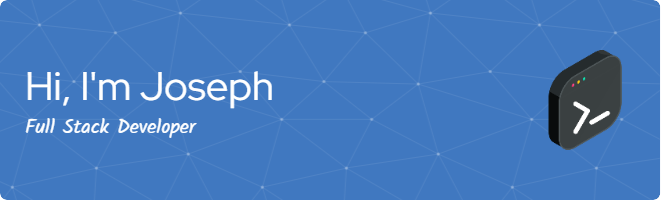

  
   
  <!--  -->
  
  

    
    
  

---

### :fire: My Stats:

  
  

---

### :man_technologist: About Me :
I am a Full Stack Developer  from California.

- :telescope: I’m working as a Software Engineer and contributing to frontend and backend for building web applications.

- :musical_note: Exploring Sound Engineering and Musicianship.

- :zap: In my free time, I solve problems on Neetcode and read tech articles.

- :mailbox:How to reach me: 
 

---

### :hammer_and_wrench: Languages and Tools :

  &nbsp;
  &nbsp;
  &nbsp;
  &nbsp;
  &nbsp;
  &nbsp;
  &nbsp;
  &nbsp;
  &nbsp;
  &nbsp;
  &nbsp;
  &nbsp;
  &nbsp;
  

